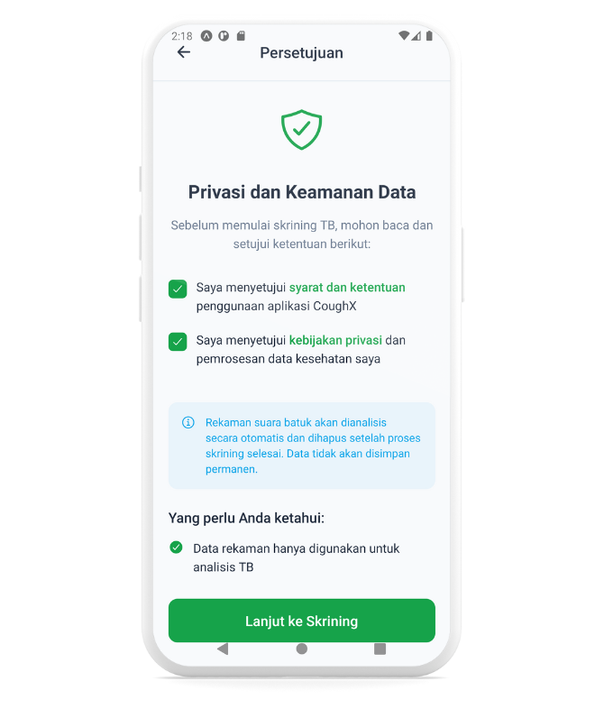
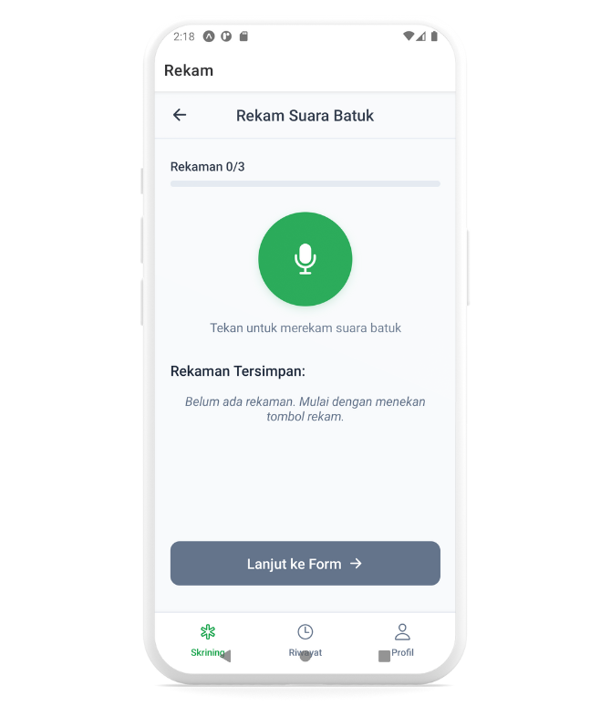
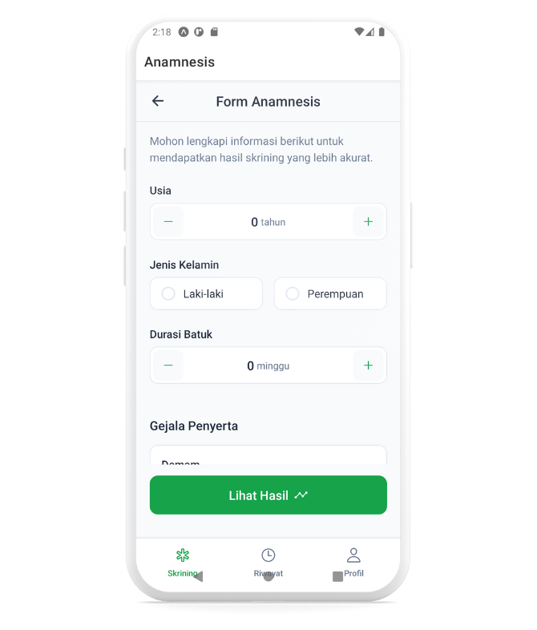
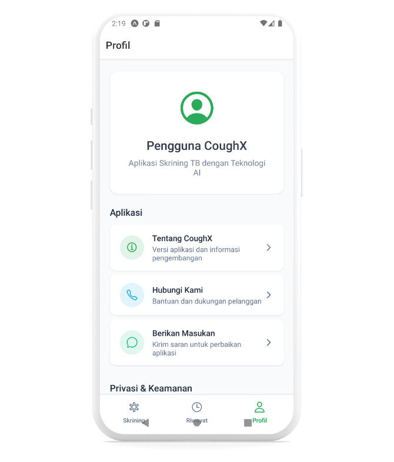

# CoughX — AI TB Screening (Mobile UI)

**CoughX** is a mobile-first user interface for **early Tuberculosis (TB) screening**. It guides users to **record cough samples**, complete a **short anamnesis**, and view an **instant risk result** (TB+ / TB–) with clear referral guidance — all localized in **Bahasa Indonesia**.

> ⚠️ **Disclaimer**: CoughX is a screening aid for demonstration and prototyping. It is **not** a medical device or a clinical diagnosis tool. Always consult a qualified health professional.

---

## ✨ What’s in this repo?

- A **standalone mobile UI** (no backend) generated from the product spec.
- Screens for **Onboarding**, **Consent (T&C)**, **Cough Recording**, **Anamnesis**, **Results**, **Referral Guidance**, **History**, and **Profile**.
- An **image set** prepared for demo and documentation (background-removed).

## 🖼️ Screens (Preview)

### Onboarding

  
  
  

### Terms & Consent

### Recording Guidance & Cough Capture

  
  

### Anamnesis (Short Questionnaire)

### Profile

> Tip: If GitHub’s markdown doesn’t render these inline images, open them from the folder above or view the README in a markdown preview tool.

---

## 🧭 Core Flows

1. **Onboarding → Consent**: Explain purpose, privacy, and microphone permission.
2. **Record Cough (3x)**: Visual meter, noise/quality hints, and retry guidance.
3. **Anamnesis**: Fast, tappable questions (fever, weight loss, TB contact, duration).
4. **Result**: TB+ / TB– with confidence band and **clear next steps**.
5. **Referral Guidance**: Suggested facility types and what to bring (ID, symptoms list).
6. **History (Local)**: Last screenings for demo; delete or revisit details.
7. **Profile**: Preferences (e.g., auto-delete recordings), legal text, version.

---

## 🗣️ Language & Accessibility

- **Localization**: Bahasa Indonesia copy throughout the UI.
- **Accessibility**: Large tap targets (≥44dp), high-contrast palette, voice-over labels, and icon descriptions.

---

## 🧪 Demo Script (2–3 minutes)

1. **Open app → Onboarding → Setujui T&C**.
2. **Record** 3 cough samples; show quality hint if environment is noisy.
3. **Isi Anamnesis** (5–6 taps).
4. **Lihat Hasil** (TB+ / TB–) + **Rujukan**.
5. **Tutup** and show entry in **Riwayat**.
6. Open **Profil** to show preferences & legal disclaimer.

---

## 🗺️ Roadmap Ideas (Post-hackathon)

- **Result screen** enhancements (confidence explanation, shareable referral).
- **Facility finder** (map, distance, open hours).
- **Offline-first** UI for recording → queued upload (when backend exists).
- **Analytics** view for health workers (once a dashboard is added).

---

## 📜 License & Attribution

- UI and images © CoughX team. Do not reuse without permission.
- “CoughX” is a project codename for hackathon use only.
- Medical disclaimer applies; see “Disclaimer” above.

---

### Acknowledgements

- Thanks to the team for UI assets and prototypes.
- This UI was structured to align with an **Acoustic TB**-style screening engine (not included here).
